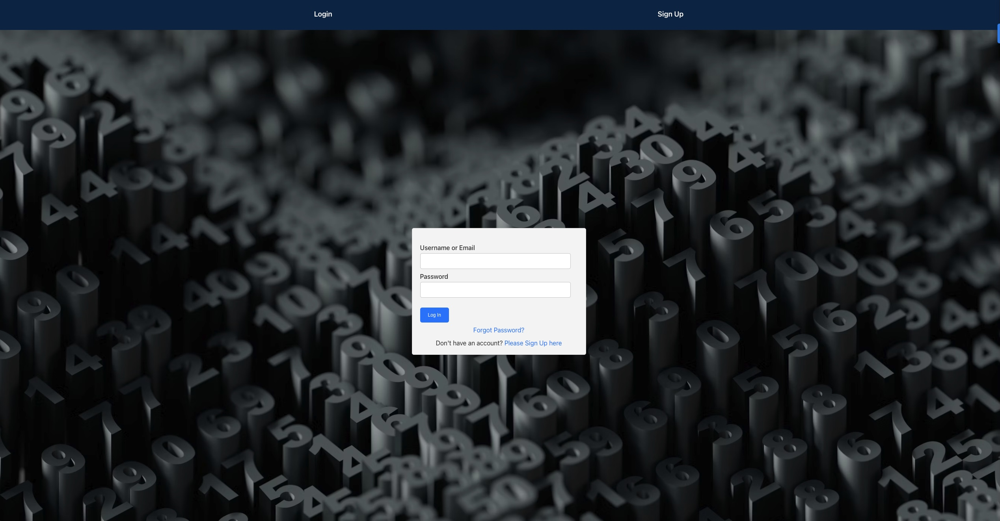

# Algify Website

Welcome to Algify, a platform designed to help you master data structures and algorithms through instructional videos and walkthroughs. Whether you're preparing for technical interviews, competitive programming competitions, or simply seeking to deepen your understanding of fundamental concepts, Algify provides a comprehensive resource to support your learning journey.

You can access the live project here: [Algify](https://algify.onrender.com)

## Table of Contents
- [Screenshots](#screenshots)
- [Features](#features)
- [Technologies Used](#technologies-used)
- [Getting Started](#getting-started)
  - [Installation](#installation)
  - [Usage](#usage)
- [License](#license)

<h2 id="screenshots">Screenshots</h2>

Here are some screnshots of the Algify Website:

### Signup Page

### Login Page

### Home Page

### Video Page

<h2 id="features">Features</h2>

- **Structured Learning:** Explore curated algorithmic problems organized by topics such as arrays, strings, linked lists, binary trees, graphs, and dynamic programming.
- **Interactive Problem Solving:** Write solutions directly within test files, allowing hands-on application of algorithms and data structures concepts.
- **Comprehensive Testing:** Validate solutions using Mocha testing framework with a comprehensive test suite covering various problem scenarios and edge cases.
- **Immediate Feedback:** Receive instant feedback on test case results to iterate and improve solution correctness and efficiency.
- **Customizable Testing:** Run specific test suites or individual problem tests based on learning objectives.
- **Efficient Learning:** Practice algorithmic problems efficiently in a structured and guided manner.
- **Educational Resources** Access approach and walkthrough videos for enhanced understanding of problem-solving techniques and algorithmic concepts.

Tests are located in a separate Git repository: [Algify-problems](https://www.github.com/jandos0492/algify-problems.git)

<h2 id="technologies-used">Technologies Used</h2>

- HTML5
- CSS
- JavaScript
- React.js
- Redux
- React Router
- Express
- Postgres
- Sequelize
- JWT (JSON Web Token)

<h2 id="getting-started">Getting Started</h2>

<h3 id="installation">Installation</h3>

To run the project locally, follow these steps:

1. Clone this repository: `git clone https://github.com/jandos0492/algify.git`
2. Navigate to the project directory: `cd algify`
3. Navigate to the backend directory: `cd backend`
4. Install backend dependencies: `npm install`
5. Create the database: `npm run db:create`
6. Start the backend development server: `npm start`
    - The backend server should now be accessible in your browser at `http://localhost:3000`
7. Navigate to the frontend directory: `cd ../frontend`
8. Install the frontend dependencies: `npm install`
9. Start the development server: `npm start`
    - The website should now be accessible in your browser at: `http://localhost:3001`

<h3 id="usage">Usage</h3>

The Algify app provides a structured approach to learning algorithmic problem-solving. Follow these steps to maximize your learning experience:

#### 1. User Authentication

- **Sign Up:** If you're a new user, click on the "Sign Up" link located on the navigation bar. Provide the required information to create your account. 

- **Sign In:** If you already have an account, click on the "Sign In" link on the navigation bar. Enter your credentials (email and password) to log in. If you forget your password, use the "Forgot Password" link to reset it.

#### 2. Explore Algorithmic Problems

Browse through the collection of algorithmic problems categorized by topics such as arrays, strings, linked lists, binary trees, graphs, and dynamic programming.

#### 3. Write Solutions

Write your solutions directly within the corresponding test files in the Algify Problems repository. This hands-on approach allows you to apply algorithmic concepts and practice problem-solving skills.

#### 4. Run Tests

Utilize the Mocha testing framework to validate your solutions. Tests are available in the Algify Problems repository. Use the command npm test to execute all tests or run specific tests using mocha test/some-folder/some-problem.test.js.

#### 5. Review Test Results

Review the test results to identify any failed tests and understand where improvements are needed. Iterate on your solutions to enhance correctness and efficiency.

#### 6. Customizable Testing

Customize your testing approach by running specific test suites or individual problem tests based on your learning objectives.

#### 7. Access Educational Resources

Explore approach and walkthrough videos available on the Algify website to gain deeper insights into problem-solving techniques and algorithmic concepts.

Tests are located in a separate Git repository: [Algify-problems](https://www.github.com/jandos0492/algify-problems.git)

Happy coding and algorithm mastering!

<h2 id="license">License</h2>

This project is licensed under the MIT License.   